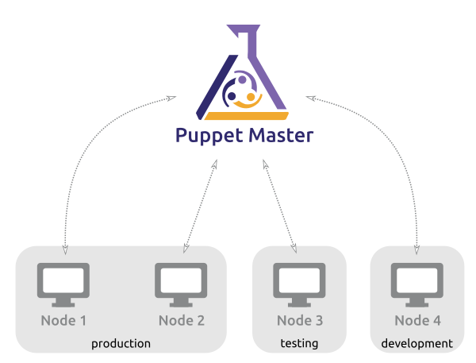

# **Puppet**

## O que é o Puppet?  

A framework Puppet foi criada por Luke Kanies e a sua empresa, Puppet Labs.  
É usado principalmente para gerir configurações de sistemas UNIX,Linux e até mesmo Windows, tendo como principal função gerir um host durante todo o seu ciclo de vida, desde a build inicial aos upgrades, manutenção e finalmente o fim do ciclo, de forma a que haja uma interação contínua com os hosts em vez de serem apenas criados e "abandonados".  
O Puppet possui um modelo que torna bastante fácil a sua compreensão e implementação. Esse modelo tem 3 componentes:

* **Deployment**
* **Configuration Layer e Resource Abstraction Layer**
* **Transactional Layer**

### **Deployment**

O Puppet é normalmente implementado num simples modelo cliente-servidor. O servidor é apelidado de _Puppet Master_, enquanto o software Puppet do cliente é descrito como um _agent_  e o host de cada agente em si é definido como um _node_.  

  

O _Puppet Master_ corre num host como um _daemon_ e contém as configurações necessárias para um determinado ambiente. Os _Puppet agents_ conectam-se ao _Puppet Master_ através de uma conexão encriptada e autenticada via SSL standart de modo a conseguirem obter qualquer configuração que necessite ser aplicada. O _Puppet Master_ só atua sobre os agentes caso seja necessário uma alteração nas suas configurações, caso contrário, não faz nenhuma operação nos mesmos. Este processo é denominado de _configuration run_.  
A prática mais recorrente para o Puppet em cada agente é executá-lo como _daemon_ para que este verifique periodicamente com o _Puppet Master_ se a configuração está atualizada e caso seja necessário, receber novas configurações. O Puppet agent está definido para fazer esta verificação a cada 30 min por default, podendo ser alterado este período de tempo de acordo com cada ambiente de trabalho. Existem outros modelos de implementação, por exemplo, o Puppet pode ser executado em _stand-alone mode_ onde não existe um _Puppet Master_ onde as configurações são instaladas localmente em cada um dos hosts e o _puppet binary_ é executado de modo a aplicar as mesmas configurações.

### **Configuration Language e Resource Abstraction Layer**

O _Puppet_ utiliza uma linguagem declarativa para definir itens de cada configuração, que são chamados de _resources_. O facto de existir esta natureza declarativa permite fazer uma distinção entre o _Puppet_ e outras ferramentas de configuração, pois permite fazer declarações acerca do estado da configuração, como por exemplo, declarar que um pacote precisa de ser instalado ou um serviço que precisa de ser inicializado.  
Ao contrário de dizer como é que se deve proceder para chegar a determinada configuração, o _Puppet_ apenas declara como terá que ser o seu estado final, ou seja, os admins de sistemas com _Puppet_ apenas se preocupam com o estado final dos hosts e não em como é que se chegou a esse estado e é esse o problema do _Puppet_.

#### **Configuration Language**

Queremos por exemplo, instalar num conjunto de hosts a aplicação _vim_ em cada um deles. Se o pretendido fosse fazer este processo manualmente, era necessário uma conexão a cada host (incluindo a inserção de passwords, etc.), verificar se cada um já tem ou não o _vim_ instalado e caso não esteja, executar individualmente o comando de instalação.  
No _Puppet_ a abordagem é diferente. Inicialmente começa por se definir uma configuração de recursos para o package _vim_. Cada recurso é constituído por um _type_ (tipo de recurso que está a ser usado), _title_ (o nome do recurso), e uma série de _attributes_ (valores que espeficam por exemplo, se o serviço está parado ou em funcionamento).  

`package { "vim":  
    ensure => present,  
}`  

As declarações acima representam que um package chamado "_vim_" deve ser instalado, sendo "package" o _type_. Esta definição é construída da seguinte forma:  
`type { title:  
    attribute => value,  
}`

Em relação aos atributos, estes dizem ao _Puppet_ qual o estado pretendido desta configuração. No exemplo acima descrito, o atributo _ensure_ especifica o estado do _package_ (instalado, desinstalado, etc.). Já o valor _present_ indica que queremos instalar o _package_. Caso o pretendido fosse desinstalar, teria que se alterar o valor do atrbuto para _absent_.

Para uma lista completa dos _types_ e _attributes_ que o _Puppet_ dispõe, visitar este [link](https://puppet.com/docs/puppet/7/type.html).

#### **Resource Abstraction Layer**

Quando completa a configuração dos recursos, o _Puppet_ automaticamente sabe como gerir determinado recurso a partir do momento em que um agente se conecta ao _Puppet Master_, através de uma ferramenta chama **_Facter_**, que retorna toda a informação acerca daquele agente, incluindo o sistema operativo que está a utilizar. O _Puppet_ escolhe o _package provider_ adequado para tal sistema operativo e usa esse mesmo _provider_ para verificar se determinado _package_ já se encontra ou não instalado e caso não esteja, instalá-lo (como foi visto no exemplo acima). No final desta operação, o _Puppet_ vai reportar ao _Puppet Master_ se a aplicação destes recursos foi bem sucedida ou não.

#### **Transactional Layer**