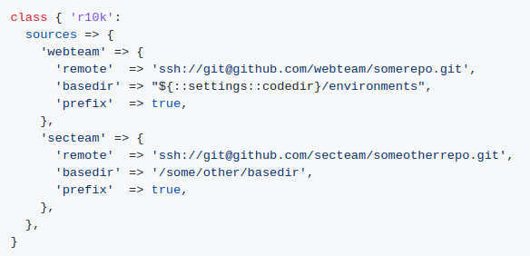

# **Puppet**

## **O que é o Puppet?**  

A framework _Puppet_ foi criada por Luke Kanies e a sua empresa, Puppet Labs.  
É usado principalmente para gerir configurações de sistemas UNIX,Linux e até mesmo Windows, tendo como principal função gerir um host durante todo o seu ciclo de vida, desde a build inicial aos upgrades, manutenção até ao fim do ciclo, para que haja uma interação contínua com os hosts em vez de serem apenas criados e "abandonados".  
O _Puppet_ possui um modelo que torna bastante fácil a sua compreensão e implementação. Este modelo tem 3 componentes:

* **Deployment**
* **Configuration Layer e Resource Abstraction Layer**
* **Transactional Layer**

### **Deployment**

O _Puppet_ é normalmente implementado num simples modelo cliente-servidor. O servidor é apelidado de **_Puppet Master_**, enquanto o software _Puppet_ do cliente é descrito como um **_agent_**  e o **host** de cada agente em si é definido como um **_node_**.  

  

O _Puppet Master_ corre num host como um _daemon_ e contém as configurações necessárias para um determinado ambiente. Os _Puppet agents_ conectam-se ao _Puppet Master_ através de uma conexão cifrada e autenticada via SSL standart de modo a conseguirem obter qualquer configuração que necessite ser aplicada. O _Puppet Master_ só atua sobre os agentes caso seja necessária uma alteração nas suas configurações, caso contrário, não realiza nenhuma operação sobre os mesmos. Este processo é denominado de _configuration run_.  
A prática mais recorrente para o _Puppet_ em cada agente é executá-lo como _daemon_ para que este verifique periodicamente com o _Puppet Master_ se a configuração está atualizada e caso seja necessário, receber novas configurações. O Puppet agent está definido para fazer esta verificação a cada 30 minutos por default, podendo ser alterado este período de tempo de acordo com cada ambiente de trabalho. Existem outros modelos de implementação, por exemplo, o _Puppet_ pode ser executado em _stand-alone mode_ onde não existe um _Puppet Master_ onde as configurações são instaladas localmente em cada um dos hosts e o _puppet binary_ é executado de modo a aplicar as mesmas configurações.

### **Configuration Language e Resource Abstraction Layer**

O _Puppet_ utiliza uma linguagem declarativa para definir os itens de cada configuração, que são chamados de _resources_. O facto de ser usa uma linguagem de natureza declarativa permite fazer uma distinção entre o _Puppet_ e outras ferramentas de configuração, pois permite fazer declarações acerca do estado da configuração, como por exemplo, declarar que um _package_ precisa de ser instalado ou que um serviço que precisa de ser inicializado.  
Em vez de dizer como é que se deve proceder para chegar a uma determinada configuração, o _Puppet_ apenas declara como terá que ser o seu estado final, ou seja, o admin de um sistema _Puppet_ apenas se preocupa com o estado final dos hosts e não em como é que se chegou a esse estado e esse é o principal problema do _Puppet_.

#### **Configuration Language**

Queremos por exemplo, instalar num conjunto de _nodes_ a aplicação _vim_ em cada um deles. Se o pretendido fosse fazer este processo manualmente, era necessário uma conexão a cada host (incluindo a inserção de passwords, etc.), verificar se cada um já tem ou não o _vim_ instalado e caso não esteja, executar individualmente o comando de instalação.  
No _Puppet_ a abordagem é diferente. Inicialmente define-se uma configuração de recursos para o package _vim_. Cada recurso é constituído por um _type_ (tipo de recurso que está a ser usado), _title_ (o nome do recurso), e uma série de _attributes_ (valores que especificam por exemplo, se o serviço está parado ou em funcionamento).  

`package { "vim":`  
    `ensure => present,`  
`}`

As declarações acima representam que um package chamado "_vim_" deve ser instalado, sendo "_package_" o _type_. O construtor desta definição tem o seguinte formato:  

`type { title:`  
    `attribute => value,`  
`}`

Em relação aos atributos, estes dizem ao _Puppet_ qual o estado pretendido para esta configuração. No exemplo acima descrito, o atributo _ensure_ especifica o estado do _package_ (instalado, desinstalado, etc.). Já o valor _present_ indica que queremos instalar o _package_. Caso o pretendido fosse desinstalar, teria que se alterar o valor do atrbuto para _absent_.

Para uma lista completa dos _types_ e _attributes_ que o _Puppet_ dispõe, visitar este [link](https://puppet.com/docs/puppet/7/type.html).

#### **Resource Abstraction Layer**

Quando completa a configuração dos recursos, o _Puppet_ automaticamente sabe como gerir determinado recurso a partir do momento em que um agente se conecta ao _Puppet Master_, através de uma ferramenta chama **_Facter_** (abordado mais à frente), que retorna toda a informação acerca daquele agente, incluindo o sistema operativo que está a utilizar. O _Puppet_ escolhe o _package provider_ adequado para tal sistema operativo e usa esse mesmo _provider_ para verificar se determinado _package_ já se encontra ou não instalado e caso não esteja, instalá-lo (como foi visto no exemplo acima). No final desta operação, vai ser reportado ao _Puppet Master_ se a aplicação destes recursos foi ou não bem sucedida.

#### **Transactional Layer**

A _Transactional Layer_ do _Puppet_ é o seu "motor", pois corresponde à fase de por em ação todas estas configurações, incluindo:

* Interpretar e compilar as configurações
* Comunicar as configurações compiladas ao agente
* Aplicar essas configurações no agente
* Reportar os resultados desta aplicação ao _Puppet Master_

O primeiro passo para o _Puppet_ é analisar a configuração e perceber como a aplicar no agente. Para isto, o _Puppet_ cria um gráfico com todos os recursos criados, as relações entre si e para cada agente. Isto permite trabalhar numa determinada ordem baseada nas relações criadas para aplicar recursos a cada host. Este modelo é um dos pontos fortes do _Puppet_.  
O _Puppet_ pega nos recursos e compila-os num "catálogo" para cada agente. O catálogo é enviado para o respetivo host e aplicado pelo agente. Os resultados desta aplicação são finalmente enviados para o _Puppet Master_ em forma de relatório.  
A _Transactional Layer_ permite que sejam criadas configurações e que sejam aplicadas repetidamente num host. Apesar disto, as configurações podem ser aplicadas as vezes que forem necessárias num host sempre com o mesmo resultado, sem pôr em causa a consistência das mesmas.  
Estas operações feitas pelo _Puppet_ não criam qualquer tipo de logs, ou seja, não se pode fazer um _rollback_ de qualquer transação, no entanto, é possível fazer estas transações num _noop (no operation mode)_, que permite testar uma execução sem fazer quaisquer mudanças num _node_.

## **Versões do Puppet**

O modelo de implementação mais comum do _Puppet_ é cliente-servidor. É lógico que para haver um bom funcionamento deste processo, o master e os seus agentes teriam que estar na mesma versão do _Puppet_, porém, pode haver uma diferença de versões entre ambos, desde que o _Puppet Master_ esteja numa versão mais recente que a dos agentes. Apesar disto, é sempre mais recomendável ter a versão dos agentes o mais próximo possível do master, de forma a tirar a máxima perfomance do funcionamento do _Puppet_.  
Cada versão  do _Puppet_ possui o formato X.Y.Z., onde:

* X aumenta apenas para mudanças bastante significativas, que seriam incompatíveis com a versão anterior
* Y aumenta apenas para novas funcionalidades que continuam a ser compatíveis com a versão anterior ou resoluções de bugs bastante significantes
* Z aumenta apenas para pequenas resoluções de bugs

Principais upgrades introduzidos em versões major do _Puppet_:

* [Puppet 4](https://github.com/puppetlabs/docs-archive/blob/main/puppet/4.0/release_notes.markdown):  
Mudanças no _Support_, repositórios e na instalação, nova versão da linguagem, diferença nos  URL's que os agentes utilizam para comunicar com o master, bug fixes, etc.

* [Puppet 5](https://github.com/puppetlabs/docs-archive/blob/main/puppet/5.0/release_notes.markdown):
Aquando do release desta versão, houve bastates funções que eram **_deprecated_** (já não estavam a ser úteis ao funcionamento do _Puppet_ mas ainda constavam no código fonte do mesmo) no _Puppet 4_, adição de novas funções como _call_ e _unique_ e upgrade das versões de _Ruby_ e _Hiera_ (detalhado mais à frente).

* [Puppet 7](https://puppet.com/blog/whats-new-in-puppet-7-platform/):
Upgrade da versão do _Facter_ (4) e do _Ruby_ (2.7), mudanças na organização dos ficheiros, nas definições e em alguns comandos da aplicação e ainda mudanças na linguagem e no próprio servidor.

## **Tecnologias relevantes no Puppet**

* **Facter**  
É uma ferramenta que retorna factos sobre cada agente, como o seu hostname, o endereço IP, o sistema operativo e a sua versão, juntamente com muitos outros dados, que são recolhidos a partir do momento em que o agente entra em execução. Os factos são enviados para o _Puppet Master_, que automaticamente são transformados em variáveis para o _Puppet_.  
Caso seja necessário visualizar os factos disponíveis, basta correr o  _facter binary_ na linha de comandos. Cada facto é retornado como um par `key => value`. Por exemplo:  
`operatingsystem => Ubuntu`  
`ipaddress => 10.0.0.10`  
Quando combinados com a configuração definida no _Puppet_, estes factos permitem personalizar as configurações para cada host, como por exemplo, criar recursos genéricos como definições de _network_ e personalizar com dados de cada agente, ou até mesmo escolher de acordo com o sistema operativo em uso que comandos usar para instalar um determinado package, como por exemplo, se o _Facter_ verificar que se trata de um sistema Ubuntu, utilizar o comando aptitude, se for Red Hat usar yum, etc.

* **Hiera**  
Um dos pontos fortes do _Puppet_ é o facto de o código ser reutilizável. Um código que serve várias necessidades tem que ser configurável: colocar informação específica numa configuração externa, em vez de estar presente no código fonte.  
O _Puppet_ utiliza o _Hiera_ em duas vertentes, sendo elas guardar os dados das configurações em pares _key-value_ e procurar que dados é que um certo módulo precisa para aplicar a um certo _node_ durante a compilação de um catálogo. Estas duas operações são feitas, respetivamente, através de [_Automatic Parameter Lookup_](https://puppet.com/docs/puppet/7/hiera_automatic.html#hiera_automatic) para classes incluídas num catálogo e _Explicit lookup calls_.  
A hierarquia de _lookups_ do _Hiera_ funciona através de um padrão de _"defaults, with overrides”_, ou seja, se a solução _default_ não funcionar temos uma hierarquia de alternativas. O _Hiera_ usa os factos do _Puppet_ para especificar as _data sources_, para que seja possível existir um _override_ na infraestrutura em causa. Esta ferramenta funciona como se fosse uma função, que recebe argumentos de cada um dos _nodes_ e age em função dos mesmos.

* **Puppet Server**  
O _Puppet_ é configurado numa arquitetura agente-servidor, em que o servidor primário (_Puppet Master_) gere as configurações de todos os _agent nodes_. O _Puppet Server_ atua como o servidor primário, sendo ele uma aplicação em _Ruby_ que corre numa Java Virtual Machine (JVM) e tem como objetivo compilar os catálogos e determinados ficheiros nos interpretadores de _JRuby_.

* **Puppet DB**  
Todos os dados gerados pelo _Puppet_ (factos, catálogos ou reports) são guardados na _PuppetDB_.  
Guardar toda a informação nesta base de dados permite ao _Puppet_ operar mais rapidamente e permite que as aplicações acedam à informação mais facilmente.

* **r10k**  
É uma ferramenta que permite gerir as configurações de um determinado ambiente. As alterações no código são feitas através da linha de comandos do _r10k_ no servidor primário. Com base no código nos branches dos repositórios de controlo, o _r10k_ cria ambientes no server primário para aplicar em cada _node_. No fundo, é bastante útil para não termos que aplicar a totalidade do código num determinado _node_ mas sim dividi-lo em branches e aplicá-los em _nodes_ separadamente. Exemplo de uma aplicação de dois branches em diferentes direções:  

* **MCollective**
É utilizado num modelo _publish / subscribe_ para distribuir comandos em paralelo dentro de um sistema ou até mesmo em vários sistemas distintos, permitindo ao _MCollective_ (_Marionette Collective_) decidir quais das mensagens executar, com base num conjunto de filtros em cada uma. A mensagem é passada então aos módulos dos agentes para serem executadas. Uma analogia para esta ferramenta é por exemplo, num chat, em que recebemos todas as mensagens que são enviadas, porém, as mensagens a nós destinadas iriam aparecer apenas para nós.
